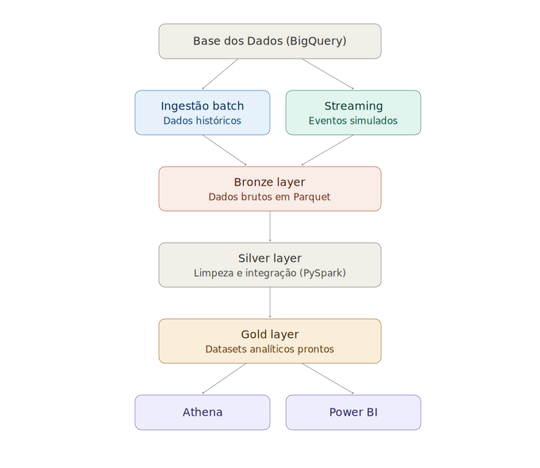

# Pipeline Híbrido para Análise da Alfabetização no Brasil

> Tech Challenge – Fase 2. Pipeline híbrido (Batch + Streaming) seguindo a Arquitetura Medalhão
> (Bronze, Silver, Gold) para análise do Indicador Criança Alfabetizada.

## Contexto do problema

O **Compromisso Nacional Criança Alfabetizada** é uma política pública que mobiliza União, estados e
municípios para que todas as crianças estejam alfabetizadas até o final do 2º ano do ensino
fundamental, com meta para 2030. O parâmetro oficial é o **Indicador Criança Alfabetizada**: o
percentual de estudantes que atingem 743 pontos na escala de proficiência do Saeb, ponto de corte
definido pelo Inep em 2023.

O desafio não está em olhar esse indicador isolado, mas em cruzá-lo com as metas oficiais para
enxergar onde o Brasil está performando acima ou abaixo do esperado. Este pipeline entrega
exatamente essa integração: uma base única, versionada por ano, pronta para consulta e
visualização. Nos dados levantados, o indicador nacional evoluiu de 60,71% para 62,21% entre 2023 e
2024 — uma melhora razoável, mas que ainda expõe grande desigualdade regional (de cerca de 90% no
Ceará até 34% em Sergipe).

## Por que essas 7 tabelas

Escolhemos as tabelas que nos permitem responder duas perguntas centrais: onde estamos e onde
precisamos chegar. As tabelas de indicadores (resultado real, por UF e por município) mostram a
evolução anual da taxa de alfabetização. As tabelas de meta mostram o objetivo oficial até 2030. E
ao trazer os dois níveis geográficos conseguimos identificar discrepâncias regionais: municípios e
estados diferentes partem de níveis de ensino muito diferentes, e um indicador nacional único
esconderia essa desigualdade.

## Arquitetura da solução

O pipeline segue a Arquitetura Medalhão, com ingestão híbrida batch + streaming:



**Fluxo de dados:**
1. **Fontes**: tabelas da [Base dos Dados](https://basedosdados.org) (BigQuery público):
   - Territórios: UF, Município (`br_bd_diretorios_brasil`)
   - Metas: Brasil, UF, Município (`br_inep_avaliacao_alfabetizacao`)
   - Indicadores: por UF, por Município (`br_inep_avaliacao_alfabetizacao`)
2. **Ingestão batch**: leitura periódica de todas essas tabelas, sem transformação,
   persistidas em Parquet com particionamento por ano (para tabelas com série histórica).
3. **Ingestão streaming**: simulação de eventos de atualização do indicador em micro-lotes, representando
   a chegada de novas medições em tempo quase real.
4. **Bronze**: dados brutos, sem tratamento, com carimbo de data de ingestão para rastreabilidade.
5. **Silver**: limpeza (duplicados, nulos), padronização de nomes/tipos e integração das bases pela chave
   de município/UF/ano.
6. **Gold**: datasets analíticos prontos para consumo — indicador por município, meta vs. resultado,
   evolução temporal.
7. **Consumo**: consultas via Athena e dashboards em Power BI.

## Tecnologias utilizadas

| Camada | Tecnologia | Justificativa |
|---|---|---|
| Armazenamento | AWS S3 + Parquet | Custo baixo, formato colunar eficiente para leitura analítica |
| Processamento | pandas + PyArrow | Volume de dados do desafio não justifica overhead operacional de um cluster Spark |
| Consulta | AWS Athena | Serverless, paga por consulta, sem infraestrutura para gerenciar |
| Streaming | Simulação em Python | Suficiente para demonstrar a arquitetura híbrida |
| Dashboard | Power BI | Conecta direto na camada Gold para visualização de negócio |
| Versionamento | GitHub (branches + PR) | Rastreabilidade da evolução do pipeline |

## Decisões arquiteturais (trade-offs)

### Batch vs. streaming — justificativa por fonte

Não usamos batch e streaming "porque foi pedido" — cada fonte foi classificada pela frequência real
com que ela muda:

| Fonte | Abordagem | Por quê |
|---|---|---|
| UF (diretório) | Batch | Dado de referência geográfica, praticamente estático |
| Município (diretório) | Batch | Dado de referência geográfica, praticamente estático |
| Meta Alfabetização Brasil | Batch | Definida em ciclo de política pública (anual/plurianual), publicada uma vez por ano |
| Meta Alfabetização por UF | Batch | Publicada periodicamente em ciclos administrativos definidos |
| Meta Alfabetização por Município | Batch | Publicada periodicamente em ciclos administrativos definidos |
| Indicador por UF | Streaming (simulado) | É o dado que representa "nova medição chegando" — o caso de uso natural para ingestão incremental quase em tempo real (ex: nova avaliação de desempenho processada assim que disponível) |
| Indicador por Município | Streaming (simulado) | Mesmo raciocínio — novo resultado de desempenho por município chegando continuamente |

Ou seja: 5 das 7 entidades são batch porque mudam em ciclos administrativos, não em tempo real. Só o
indicador de desempenho (2 das 7: por UF e por Município) justifica streaming, e mesmo assim como
*simulação* — não existe uma fonte de streaming real do governo para este indicador.

### Kafka vs. alternativa mais simples

Para um cenário com poucos eventos simulados, a utilização do Kafka só aumentaria a complexidade
operacional, com poucos benefícios concretos. A simulação dos eventos é mais simples e, além disso,
a Base dos Dados disponibiliza informações históricas, sem atualizações contínuas — não existe uma
fonte real emitindo novos resultados em tempo real que justificasse a infraestrutura. Para simular,
preferimos um producer em Python que envia registros em lotes curtos (`streaming/producer_simulator.py`).

Trade-off avaliado:
- Kafka exige cluster (ou MSK gerenciado), operação de partições/consumer groups, e overhead de
  configuração que não se paga para o volume deste desafio (dezenas de eventos simulados).
- Se o volume de eventos crescesse ordens de grandeza (ex: streaming de todas as escolas do país em
  tempo real), Kafka ou Kinesis Data Streams passariam a se justificar pelo throughput e replay de
  eventos. Para o volume atual, seria over-engineering.

### Particionamento por ano

Pensamos nisso tanto para reduzir o volume de dado lido nas queries e aumentar a eficiência quanto
para otimizar custo. Além disso, o próprio objetivo do indicador é acompanhar evolução ao longo do
tempo, então manter o histórico separado por ano, ao invés de sobrescrever, é o que permite essa
comparação depois, lá na camada Gold.

Bronze, Silver e Gold particionam as tabelas com série histórica (metas e indicador) por `ano=YYYY`
(estrutura Hive), por exemplo:
```
bronze/indicador/ano=2023/
bronze/indicador/ano=2024/
bronze/indicador/ano=2025/
```
Motivo: o próprio objetivo do indicador é comparação temporal — "evolução do indicador" é um dos
datasets Gold pedidos no desafio, o que exige manter múltiplos anos disponíveis, não só o mais
recente. Particionar por ano (em vez de sobrescrever ou usar uma pasta única) reduz o volume de dado
lido em queries no Athena (que cobra por byte escaneado) quando a análise foca em um ano específico,
e é o padrão usado em data lakes de mercado. Tabelas de dimensão (UF, Município) não têm coluna de
ano e ficam sem partição.

- **Data lake vs. data warehouse**: optamos por data lake (S3 + Parquet + Athena) em vez de um data
  warehouse gerenciado, pela flexibilidade de schema-on-read e menor custo fixo — adequado ao volume
  do desafio.
- **Custo vs. performance**: o particionamento por ano acima é a principal alavanca de custo/performance
  do projeto, reduzindo o volume escaneado por consulta no Athena.

### Pandas/pyarrow vs. PySpark

Optamos por pandas/pyarrow em vez de PySpark para as camadas Silver e Gold. Mesma lógica de
custo-benefício aplicada na decisão sobre o Kafka: o volume de dados deste desafio (milhares de
linhas, não milhões) não justifica o overhead operacional de configurar e manter um cluster Spark.
Se o volume crescesse para o Censo Escolar completo ou microdados brutos do Saeb, PySpark passaria
a fazer sentido.

## Dificuldades encontradas

A maior dificuldade foi configurar a estrutura AWS pela primeira vez e reproduzir os scripts em
ambiente Windows — durante a execução, enfrentamos erros de incompatibilidade de versão entre numpy
e pandas (`_ARRAY_API not found`), que exigiu reinstalar essas bibliotecas em versões compatíveis
antes de conseguir rodar a ingestão.

## Valor de negócio (resumo executivo)

O projeto automatiza e organiza diferentes bases de dados de alfabetização, criando uma fonte única
e mais confiável, sempre pensando em otimizar custo e facilitar atualizações. Isso elimina a
atualização manual — assim que uma nova base é disponibilizada, o pipeline processa
automaticamente, e os dashboards que os gestores usam para acompanhar o indicador já refletem os
dados mais recentes.

## Monitoramento e FinOps

- **Monitoramento**: logs estruturados nos scripts de ingestão (bronze e streaming) registram volume
  processado, falhas e timestamp de cada execução — base para alertas futuros.
- **Controle de custos**:
  - Armazenamento em Parquet particionado (reduz custo de storage e de scan no Athena)
  - Uso do free tier do BigQuery para consulta à Base dos Dados (até 1 TB/mês grátis)
  - Athena serverless: sem cluster ocioso, paga só pelo que é consultado
  - S3 lifecycle rules (sugestão): mover dados antigos da camada bronze para S3 Glacier

## Qualidade de dados

Rodada via `quality/validations.py`, cobrindo:
- Duplicidade de registros
- Valores ausentes por coluna
- Unicidade de chave primária
- Consistência referencial entre tabelas (ex: todo `id_municipio` na tabela de indicador existe na
  tabela de município)

## Aplicação em IA

A camada Gold, já limpa e integrada, pode alimentar:
- **Modelos preditivos** de risco de não-alfabetização por município, usando indicadores
  socioeconômicos e de infraestrutura escolar como features
- **Clusterização** de municípios por padrão de vulnerabilidade educacional
- **Análises de desigualdade** comparando evolução do indicador entre regiões e correlacionando com
  investimento (FUNDEB) ou contexto socioeconômico (IBGE/PNAD)

## Estrutura do repositório

```
project/
├── bronze/         # Ingestão de dados brutos (sem transformação)
├── silver/         # Limpeza, padronização e integração (pandas/PyArrow)
├── gold/           # Datasets analíticos finais
├── streaming/       # Simulação de eventos em tempo quase real
├── quality/         # Scripts de validação de qualidade de dados
├── evidencias/      # Documentação mostrando como funciona 
└── diagrams/         # Diagramas de arquitetura
```

## Resultados da camada Gold

A partir da execução real do pipeline, obtivemos:
- **Gold 1 (indicador por município)**: 15.219 linhas
- **Gold 2 (meta vs. resultado)**: 7.065 linhas (após remover 2023, que não tem meta definida)
- **Gold 3 (evolução temporal)**: taxa de alfabetização nacional evoluiu de **60,71% (2023) para
  62,21% (2024)** — uma melhora de 1,5 pontos percentuais em um ano.

**Limitação conhecida**: a Base dos Dados disponibiliza, no momento da execução, apenas os anos de
2023 e 2024 para o indicador real. A evolução temporal, portanto, está limitada a 2 pontos no
momento — a estrutura particionada por ano já está pronta para incorporar novos anos assim que
forem publicados, sem necessidade de reprocessar o histórico.

## Evidências de execução em nuvem

A infraestrutura AWS não fica ativa após a entrega. Como evidência de que o pipeline foi executado
em nuvem real (não apenas simulado localmente), este repositório inclui em `evidencias/`:
- Screenshots do bucket S3 com a estrutura bronze/silver/gold particionada
- Screenshot da tabela registrada no Glue Data Catalog / consulta executada no Athena
- Logs de execução dos jobs (ingestão bronze e streaming)
- Print do resultado final na camada Gold

O vídeo executivo (até 5 min) complementa isso mostrando a execução ao vivo: buckets, jobs rodando e
o resultado consultável na camada Gold.

## Como rodar

```bash
pip install -r requirements.txt

# Bronze: ingestão das tabelas cruas
python bronze/ingest_bronze.py --billing-project SEU_PROJETO_GCP --s3-bucket SEU_BUCKET --upload-s3

# Streaming: simulação de eventos
python streaming/producer_simulator.py --n-events 30 --interval 2 --sink local

# Qualidade: validação sobre a camada bronze
python quality/validations.py --check-all --data-dir bronze

# Silver: limpeza e integração
python silver/transform_silver.py --bronze-dir bronze --silver-dir silver --s3-bucket SEU_BUCKET

# Gold: datasets analíticos finais
python gold/create_gold.py --silver-dir silver --gold-dir gold --s3-bucket SEU_BUCKET
```
 
Link Video Apresentação:
https://youtu.be/XaqOZN44MCQ
